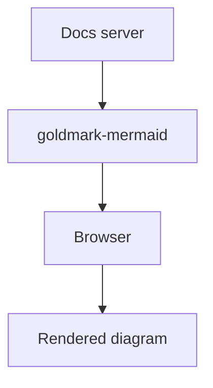

# Markdown Extensions

Dorcs includes several built-in markdown extensions that enhance your documentation without requiring any plugins.

## Accordion

The accordion extension allows you to create collapsible content sections in your markdown.

**Usage:**

```markdown
:::accordion Click to expand
This is the accordion content.
It can contain **markdown** formatting.

- Lists
- Code blocks
- And more!
:::
```

:::accordion Click to expand
This is the accordion content.
It can contain **markdown** formatting.

- Lists
- Code blocks
- And more!
:::

**Syntax:**

- Start with `:::accordion` followed by the title
- Content follows on the next lines
- End with `:::`

The accordion uses the native HTML `<details>` element, so no JavaScript is required.

## Alerts

The alerts extension supports GitHub-style alert blocks for highlighting important information.

**Usage:**

```markdown
> [!NOTE]
> This is a note alert.

> [!TIP]
> This is a tip alert.

> [!IMPORTANT]
> This is an important alert.

> [!WARNING]
> This is a warning alert.

> [!CAUTION]
> This is a caution alert.
```

> [!NOTE]
> This is a note alert.


> [!TIP]
> This is a tip alert.


> [!IMPORTANT]
> This is an important alert.


> [!WARNING]
> This is a warning alert.


> [!CAUTION]
> This is a caution alert.

**Syntax:**

- Start with `> [!TYPE]` where TYPE is one of: NOTE, TIP, IMPORTANT, WARNING, CAUTION
- Continue with `>` on subsequent lines for the alert content
- INFO is automatically converted to NOTE

**Supported Types:**

- `NOTE` - Informational content
- `TIP` - Helpful tips
- `IMPORTANT` - Important information
- `WARNING` - Warnings
- `CAUTION` - Cautions

## LaTex Support

dorcs supports LaTex math rendering using [KaTeX](https://katex.org/). Simply enclose your math in `$$` tags:

```markdown
$$
f(x) = \int_{-\infty}^\infty
\hat f(\xi)\,e^{2 \pi i \xi x}
\,d\xi
$$
```

**Result:**

$$
f(x) = \int_{-\infty}^\infty \hat f(\xi)\,e^{2 \pi i \xi x} \,d\xi
$$

Or simply use inline math:

```markdown
A pi function $f(x) = x \cdot \pi$
```

**Result:**

A pi function $f(x) = x \cdot \pi$

## Mermaid Diagrams

dorcs supports [Mermaid](https://mermaid.js.org/) diagrams for flowcharts, sequence diagrams, and more. Enclose your Mermaid code in `mermaid` code fences:

````markdown

````

**Result:**


