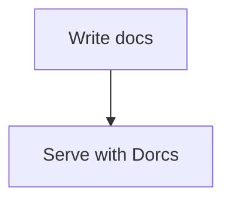

# Markdown Extensions

Dorcs includes several extensions beyond core Markdown.

## Footnotes

```markdown
Dorcs supports footnotes.[^1]

[^1]: Footnotes render at the bottom of the page.
```

## Typographic replacements

Goldmark typographer support is enabled, so common punctuation patterns are rendered more cleanly.

## Mermaid

````markdown

````

## KaTeX

Use math syntax when you need formulas in docs content.

Inline:

```markdown
$E = mc^2$
```

Block:

```markdown
$$
\int_0^1 x^2 dx
$$
```

## Syntax highlighting

Code fences are highlighted automatically. The active code theme is chosen from the selected Dorcs theme preset.

## Tabs

Use tabs to show alternative content (e.g., install instructions per OS):

```markdown
:::tabs
::tab macOS
Install with Homebrew:
\`\`\`bash
brew install dorcs
\`\`\`
::tab Linux
Download the binary:
\`\`\`bash
curl -fsSL https://example.com/install.sh | bash
\`\`\`
::tab Windows
Use the installer:
\`\`\`powershell
winget install dorcs
\`\`\`
:::
```

Each `::tab Title` starts a new tab panel. The first tab is active by default.

## Badges

Inline badges mark features, pages, or sections with status labels:

```markdown
## New Feature {badge:NEW}

This API is {badge:BETA} and may change.

The old method is {badge:DEPRECATED}.
```

Built-in badge types: `NEW`, `BETA`, `DEPRECATED`, `EXPERIMENTAL`, `REQUIRED`.

You can also use custom labels — any text works: `{badge:PREVIEW}`, `{badge:v2.0}`.

## Video embeds

Embed YouTube or Vimeo videos inline with the `{video:URL}` syntax:

```markdown
{video:https://www.youtube.com/watch?v=dQw4w9WgXcQ}

{video:https://vimeo.com/123456789}
```

Supported URL formats:

- `https://www.youtube.com/watch?v=ID`
- `https://youtu.be/ID`
- `https://www.youtube.com/embed/ID`
- `https://vimeo.com/ID`

Videos render as responsive 16:9 iframes that adapt to the content width.
