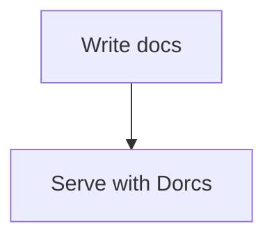

# Markdown Extensions

Dorcs includes several extensions beyond core Markdown.

## Footnotes

```markdown
Dorcs supports footnotes.[^1]

[^1]: Footnotes render at the bottom of the page.
```

## Typographic replacements

Goldmark typographer support is enabled, so common punctuation patterns are rendered more cleanly.

## Mermaid

````markdown

````

## KaTeX

Use math syntax when you need formulas in docs content.

Inline:

```markdown
$E = mc^2$
```

Block:

```markdown
$$
\int_0^1 x^2 dx
$$
```

## Syntax highlighting

Code fences are highlighted automatically. The active code theme is chosen from the selected Dorcs theme preset.
