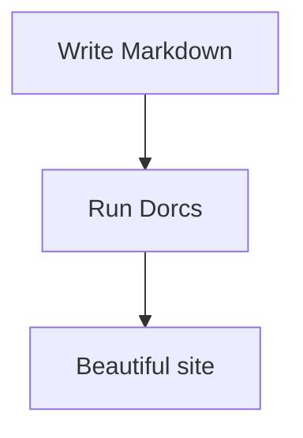

# Extensions

Beyond standard Markdown, Dorcs includes several extensions that make your docs more interactive.

## Tabs

Show alternative content — perfect for platform-specific instructions:

```markdown
:::tabs
::tab macOS
brew install my-tool
::tab Linux
apt install my-tool
::tab Windows
winget install my-tool
:::
```

:::tabs
::tab macOS
```bash
brew install my-tool
```
::tab Linux
```bash
apt install my-tool
```
::tab Windows
```powershell
winget install my-tool
```
:::

The first tab is active by default. Readers click to switch.

## Badges

Label features, sections, or status with inline badges:

```markdown
## New Feature {badge:NEW}

This API is {badge:BETA} and may change.

The old method is {badge:DEPRECATED}.
```

Built-in types:

- {badge:NEW} — new features
- {badge:BETA} — beta / preview
- {badge:DEPRECATED} — being phased out
- {badge:EXPERIMENTAL} — early stage
- {badge:REQUIRED} — mandatory items

Any custom text works too: `{badge:v2.0}`, `{badge:PRO}`, `{badge:COMING SOON}`.

## Accordions

Hide content that's useful but not essential:

```markdown
:::accordion Advanced configuration
Put detailed or optional content here.
Readers expand it only if they need it.
:::
```

:::accordion Advanced configuration
Put detailed or optional content here. Readers expand it only if they need it. Great for long code examples, edge cases, or optional setup steps.
:::

## Video embeds

Embed YouTube or Vimeo videos directly in your docs:

```markdown
{video:https://www.youtube.com/watch?v=dQw4w9WgXcQ}
{video:https://vimeo.com/123456789}
```

Supported formats:

- `https://www.youtube.com/watch?v=ID`
- `https://youtu.be/ID`
- `https://www.youtube.com/embed/ID`
- `https://vimeo.com/ID`

Videos render as responsive 16:9 iframes.

## Mermaid diagrams

Create diagrams from text using Mermaid:

````markdown

````


Mermaid supports flowcharts, sequence diagrams, Gantt charts, and more.

## Math with KaTeX

Write math formulas with LaTeX syntax.

**Inline:** `$E = mc^2$` renders as $E = mc^2$

**Block:**

```markdown
$$
\int_0^1 x^2 \, dx = \frac{1}{3}
$$
```

$$
\int_0^1 x^2 \, dx = \frac{1}{3}
$$

## Syntax highlighting

Code blocks are highlighted automatically based on the language. The color scheme matches your theme — no setup needed.

````markdown
```javascript
function greet(name) {
  return `Hello, ${name}!`;
}
```
````

```javascript
function greet(name) {
  return `Hello, ${name}!`;
}
```

Dorcs supports all major languages — just specify the name after the triple backticks.
